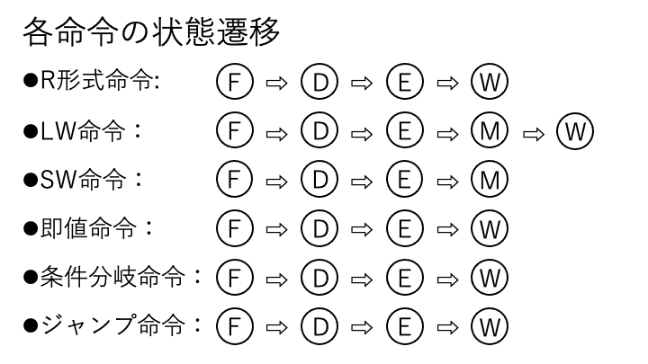

# MIPS → RISCV

## Introduction
mips2riscvはVLSI講義資料のMIPSプロセッサをRISC-Vに書き換えバージョンです。
なるべく同機能のモジュール、信号線は同じ名前にしてあります。

FETCH → DECODE → EXECUTE → MemAccess → WriteBackの流れがわかりやすくなるように改良しました。


## specification
* verilog実装
* パイプライン未実装

### サポートする命令
サポートする命令は以下の通りです。
| 命令 | 命令形式 | 命令　| 命令形式|
| -------- | -------- | -----| ----|
| add|R|addi|I|
| sub|R|slli|I|
| or|R|slti|I|
|and| R|sltiu|I|
|xor| R|xori|I|
|sll| R|srli|I|
|slt| R|srai|I|
|sltu| R|ori| I|
|slt| R|andi|I|
|srl|R|lw|I|
|sra|R|sw|I|
|beq|B|jalr|I|
|bne|B|
|jal|J|

### 各命令の状態遷移


### PC
* pcSRC
    * PC+4（特に条件なし）
    * Branch
    * Jump→簡単（Opcodeから識別可能）

* isFetch（Fetch時に1）:ControlUnit
* PCWrite = isFetch + Branch/Jump
    * PC+4する場合（1つ次の命令に進む）
    * Branch命令において、分岐条件を満たした場合
    * Jump命令が実行される場合

Opcode→isJump（Jump命令なら1）
Opcode→isBranch（Branch命令なら1）
zeroFlag（ALU）・reversezFlag（ControlUnit）・isBranch→Branch成功（分岐条件を満たしていれば1）

pcSRC　← isJump +（論理和） Branch成功


### ディレクトリ構成
ディレクトリの構成は以下の通りです。

```
.
├── README.md
├── img
│   ├── cpu_project_structure.png
│   └── state_trans.png
└── src
    ├── alu.v
    ├── alu_controller.v
    ├── alu_in_sel_A.v
    ├── alu_in_sel_B.v
    ├── control_unit.v
    ├── cpu_core.v
    ├── define_constant.v
    ├── fd_register.v
    ├── inst_memory.v
    ├── instruction_distributor.v
    ├── memory.v
    ├── memory_data_resister.v
    ├── pc_adder.v
    ├── pc_selector.v
    ├── program_counter.v
    ├── register_file.v
    └── risc_v_cpu.v
```

## Getting started


## 動作環境
Nexys4
